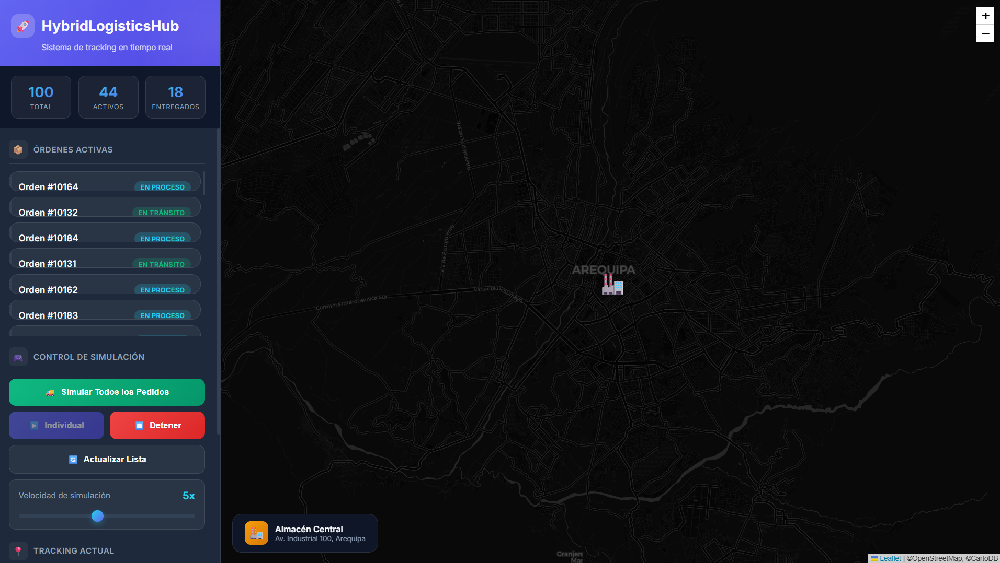
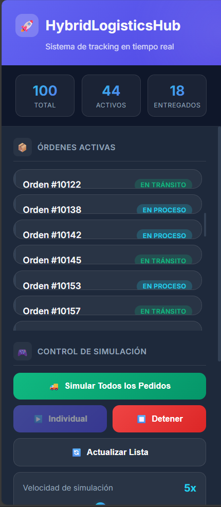
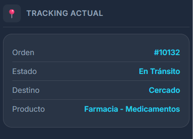
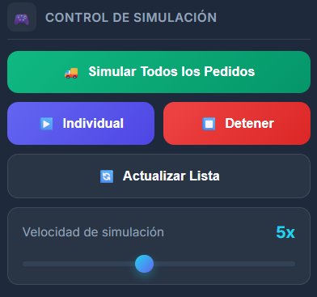
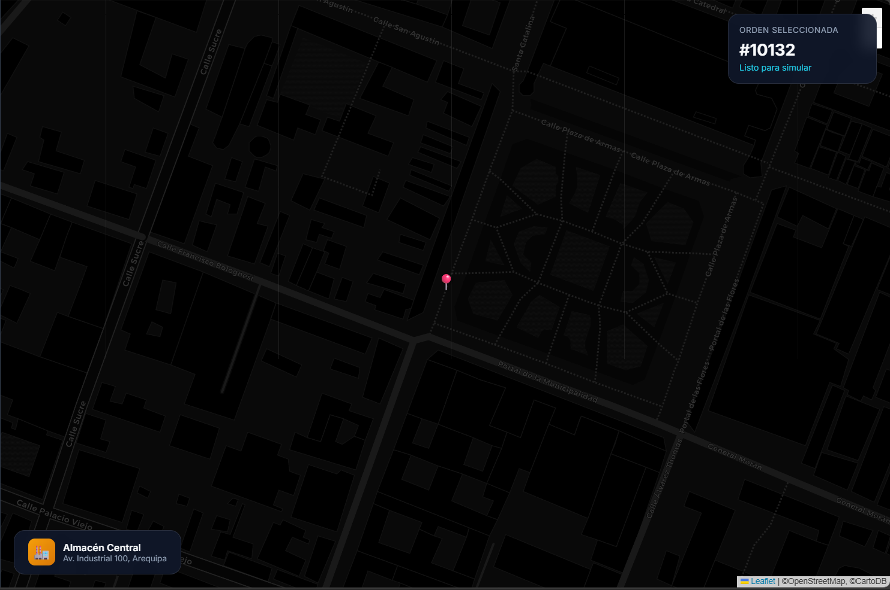
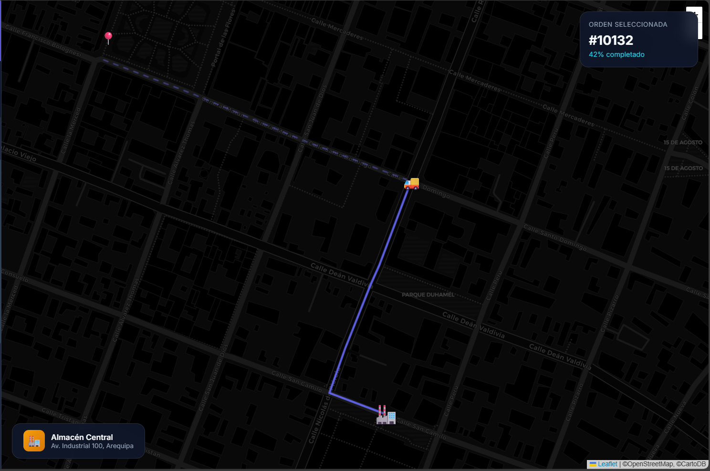
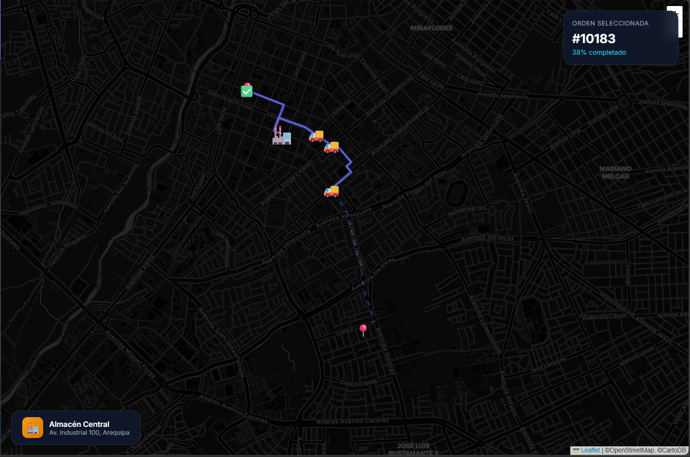

# 📖 Manual de Usuario - HybridLogisticsHub

## Sistema de Gestión Logística con Tracking en Tiempo Real

---

## 📑 Tabla de Contenidos

1. [Introducción](#1-introducción)
2. [Requisitos Previos](#2-requisitos-previos)
3. [Instalación](#3-instalación)
4. [Pantalla Principal](#4-pantalla-principal)
5. [Funcionalidades Paso a Paso](#5-funcionalidades-paso-a-paso)
6. [Casos de Uso Comunes](#6-casos-de-uso-comunes)
7. [Preguntas Frecuentes (FAQ)](#7-preguntas-frecuentes-faq)
8. [Contacto y Soporte](#8-contacto-y-soporte)

---

## 1. Introducción

**HybridLogisticsHub** es un sistema integral de gestión logística diseñado para empresas de distribución y mensajería. La aplicación permite:

- 📦 **Gestionar órdenes de envío** con información detallada de clientes y destinos
- 🗺️ **Visualizar rutas en tiempo real** sobre un mapa interactivo
- 🚚 **Simular entregas** con vehículos animados siguiendo rutas reales por calles
- 📊 **Monitorear estadísticas** de órdenes pendientes, en tránsito y entregadas

### ¿Para quién es esta aplicación?

- Operadores logísticos
- Supervisores de flotas
- Empresas de delivery y mensajería
- Personal de despacho y seguimiento

---

## 2. Requisitos Previos

### 2.1 Sistema Operativo
- **Windows 10/11** (recomendado)
- **Linux** (Ubuntu 20.04+)
- **macOS** (10.15+)

### 2.2 Software Necesario

| Software | Versión Mínima | Descarga |
|----------|----------------|----------|
| Python | 3.10+ | [python.org](https://www.python.org/downloads/) |
| Docker Desktop | 4.0+ | [docker.com](https://www.docker.com/products/docker-desktop/) |
| Git | 2.30+ | [git-scm.com](https://git-scm.com/downloads) |
| Navegador Web | Chrome/Firefox/Edge actualizado | - |

### 2.3 Conexión a Internet
Se requiere conexión a internet para:
- Cargar el mapa (OpenStreetMap)
- Calcular rutas reales (OpenRouteService API)

---

## 3. Instalación

### Paso 1: Clonar el Repositorio

```bash
git clone https://github.com/JorLOrT/BaseDeGatos2Final.git
cd HybridLogisticsHub
```

### Paso 2: Iniciar las Bases de Datos

```bash
docker-compose up -d
```

> ⏳ Espera aproximadamente 10-15 segundos para que los contenedores estén listos.

### Paso 3: Instalar Dependencias Python

```bash
pip install -r requirements.txt
```

### Paso 4: Inicializar la Base de Datos

```bash
python init_db.py
```

Este comando crea las tablas necesarias y genera **100 órdenes de ejemplo** con direcciones en Arequipa, Perú.

### Paso 5: Iniciar el Servidor

```bash
python -m uvicorn main:app --reload --port 8000
```

### Paso 6: Acceder a la Aplicación

Abre tu navegador y visita:

| Recurso | URL |
|---------|-----|
| 🗺️ **Tracking Visual** | http://localhost:8000/static/tracking_visual.html |
| 📖 **Documentación API** | http://localhost:8000/docs |

---

## 4. Pantalla Principal

### 4.1 Vista General de la Interfaz



La interfaz se divide en dos secciones principales:

```
┌────────────────────────────────────────────────────────────────┐
│                    HybridLogisticsHub                          │
├─────────────────────┬──────────────────────────────────────────┤
│                     │                                          │
│   📊 PANEL LATERAL  │           🗺️ MAPA INTERACTIVO            │
│                     │                                          │
│  ┌───────────────┐  │                                          │
│  │  Estadísticas │  │     Visualización de rutas y vehículos   │
│  │  en tiempo    │  │                                          │
│  │  real         │  │     - Marcadores de origen (verde)       │
│  └───────────────┘  │     - Marcadores de destino (rojo)       │
│                     │     - Rutas animadas                     │
│  ┌───────────────┐  │     - Vehículos en movimiento            │
│  │  Lista de     │  │                                          │
│  │  Órdenes      │  │                                          │
│  │  Pendientes   │  │                                          │
│  └───────────────┘  │                                          │
│                     │                                          │
│  ┌───────────────┐  │                                          │
│  │  Simulación   │  │                                          │
│  │  Múltiple     │  │                                          │
│  └───────────────┘  │                                          │
│                     │                                          │
└─────────────────────┴──────────────────────────────────────────┘
```

### 4.2 Componentes del Panel Lateral

#### Barra de Estadísticas


Muestra en tiempo real:
- **Pendientes**: Órdenes esperando ser procesadas
- **En Tránsito**: Órdenes actualmente en entrega
- **Entregadas**: Órdenes completadas

#### Lista de Órdenes


Cada tarjeta de orden muestra:
- ID de la orden
- Estado (color diferenciado)
- Descripción del paquete
- Dirección de destino
- Botón para simular entrega individual

#### Panel de Simulación Múltiple


Permite simular múltiples entregas simultáneamente.

### 4.3 Estados de Órdenes

| Estado | Color | Descripción |
|--------|-------|-------------|
| 🟡 **Pendiente** | Amarillo | Orden creada, esperando procesamiento |
| 🔵 **En Proceso** | Cyan | Orden siendo preparada |
| 🟢 **En Tránsito** | Verde | Orden en camino al destino |
| ⚪ **Entregado** | Gris | Orden entregada exitosamente |
| 🔴 **Cancelado** | Rojo | Orden cancelada |

---

## 5. Funcionalidades Paso a Paso

### 5.1 Visualizar Órdenes en el Mapa

1. **Selecciona una orden** de la lista haciendo clic en su tarjeta
2. El mapa se centrará automáticamente en el punto de destino
3. Aparecerá un **marcador rojo** indicando la ubicación de entrega



### 5.2 Simular Entrega Individual

1. Ubica la orden que deseas simular en la lista
2. Haz clic en el botón **"▶ Simular"** en la tarjeta de la orden
3. Observa cómo:
   - Aparece un **marcador verde** en el punto de origen (centro de distribución)
   - Se traza la **ruta real** por las calles
   - Un **ícono de vehículo** 🚚 comienza a moverse



4. Durante la simulación, la tarjeta muestra:
   - **Progreso**: Porcentaje completado (0% → 100%)
   - **Velocidad**: Velocidad actual en km/h
   - **Barra de progreso**: Visual del avance

5. Al completarse la entrega:
   - El estado cambia a **"Entregado"**
   - El progreso muestra **100%**
   - La velocidad muestra **0 km/h**

### 5.3 Simular Múltiples Entregas

1. Desplázate hacia abajo en el panel hasta la sección **"Simulación Múltiple"**
2. Configura los parámetros:
   - **Cantidad de vehículos**: Cuántas órdenes simular simultáneamente
3. Haz clic en **"🚀 Iniciar Simulación"**



4. Observa múltiples vehículos moviéndose en el mapa simultáneamente
5. Cada vehículo tiene su propia ruta y progreso independiente

### 5.4 Refrescar Lista de Órdenes

1. Haz clic en el botón **"🔄 Refrescar"** en la parte superior del panel
2. La lista se actualizará con las órdenes más recientes de la base de datos

### 5.5 Usar la API REST

Accede a la documentación interactiva en: http://localhost:8000/docs

#### Crear una nueva orden:
```json
POST /ordenes
{
  "cliente": {
    "nombre": "María García",
    "email": "maria@email.com",
    "telefono": "+51 999 888 777"
  },
  "descripcion": "Paquete electrónico",
  "direccion_origen": "Centro de Distribución, Arequipa",
  "direccion_destino": "Av. Ejercito 1200, Cayma"
}
```

#### Consultar órdenes:
```
GET /ordenes?estado=Pendiente&limite=20
```

---

## 6. Casos de Uso Comunes

### 6.1 Caso: Monitoreo de Entregas del Día

**Escenario**: Un supervisor necesita ver el estado de todas las entregas activas.

**Pasos**:
1. Abre la aplicación en http://localhost:8000/static/tracking_visual.html
2. Revisa la barra de estadísticas para ver el resumen
3. Filtra las órdenes "En Tránsito" para ver solo las activas
4. Haz clic en cada orden para ver su ubicación en el mapa

### 6.2 Caso: Simular Ruta de Entrega

**Escenario**: Un operador quiere verificar la ruta que tomará un repartidor.

**Pasos**:
1. Busca la orden específica en la lista
2. Haz clic en "Simular" para ver la ruta completa
3. Observa el tiempo estimado basado en la animación
4. La ruta se calcula usando calles reales de la ciudad

### 6.3 Caso: Prueba de Carga con Múltiples Vehículos

**Escenario**: El equipo técnico quiere probar el sistema con múltiples entregas simultáneas.

**Pasos**:
1. Ve a la sección "Simulación Múltiple"
2. Configura 5-10 vehículos
3. Inicia la simulación
4. Observa el rendimiento del sistema

### 6.4 Caso: Consultar Historial de una Orden

**Escenario**: Un cliente pregunta por el estado de su envío.

**Pasos**:
1. Abre http://localhost:8000/docs
2. Usa el endpoint `GET /tracking/{orden_id}/historial`
3. Ingresa el ID de la orden
4. Revisa el historial completo de ubicaciones y estados

---

## 7. Preguntas Frecuentes (FAQ)

### ❓ ¿Por qué no carga el mapa?

**Respuesta**: Verifica tu conexión a internet. El mapa usa OpenStreetMap que requiere conexión activa.

---

### ❓ ¿Por qué la ruta no se muestra correctamente?

**Respuesta**: El servicio OpenRouteService tiene límites de uso gratuito. Si excedes el límite, la ruta puede no calcularse. Espera unos minutos y vuelve a intentar.

---

### ❓ ¿Cómo reinicio los datos de prueba?

**Respuesta**: Ejecuta los siguientes comandos:
```bash
docker-compose down -v
docker-compose up -d
python init_db.py
```

---

### ❓ ¿Puedo agregar mis propias órdenes?

**Respuesta**: Sí, usa la API REST en http://localhost:8000/docs o modifica el archivo `init_db.py` para personalizar los datos iniciales.

---

### ❓ ¿Por qué el servidor no inicia?

**Respuesta**: Verifica que:
1. Docker esté corriendo con `docker ps`
2. Los puertos 5433 y 27017 no estén ocupados
3. Ejecutaste `docker-compose up -d` primero

---

### ❓ ¿Cómo cambio la ubicación inicial del mapa?

**Respuesta**: En `tracking_visual.html`, busca la línea donde se inicializa el mapa y cambia las coordenadas:
```javascript
const map = L.map('map').setView([-16.409, -71.537], 13); // Arequipa
```

---

### ❓ ¿El sistema funciona con datos reales?

**Respuesta**: Sí, la arquitectura está diseñada para producción. Solo necesitas:
1. Cambiar las credenciales de base de datos
2. Conectar con tu sistema de GPS real
3. Configurar las coordenadas de tu ciudad

---

## 8. Contacto y Soporte

### 👨‍💻 Desarrolladores

Este proyecto fue desarrollado para el curso de **Sistemas de Bases de Datos II** en la **Universidad de La Salle**.

### 📧 Soporte Técnico

Para reportar problemas o sugerencias:

1. **GitHub Issues**: [Crear Issue](https://github.com/JorLOrT/BaseDeGatos2Final/issues)
2. **Email**: Contactar al equipo de desarrollo

### 📚 Recursos Adicionales

- [Documentación de FastAPI](https://fastapi.tiangolo.com/)
- [Documentación de Leaflet.js](https://leafletjs.com/)
- [API de OpenRouteService](https://openrouteservice.org/dev/)

---

## 📋 Historial de Versiones

| Versión | Fecha | Cambios |
|---------|-------|---------|
| 1.0.0 | Noviembre 2025 | Versión inicial con tracking visual |

---